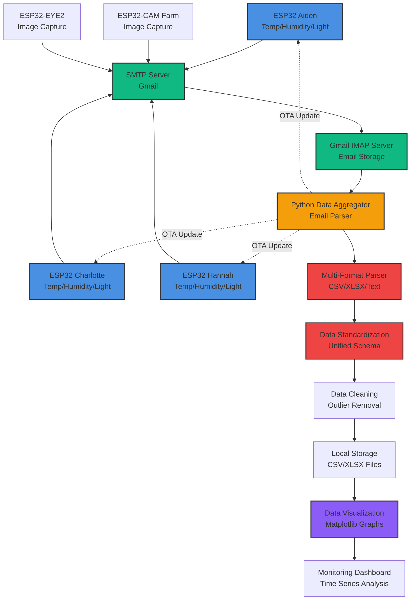

# FarmStudio - Architecture Showcase

**Senior Solution Architect | IoT Remote Monitoring System**

[](https://github.com/JuneBay/FarmStudio-Showcase)

---

## 🎯 Project Overview

**FarmStudio** is a serverless IoT data collection system for remote farm monitoring, collecting sensor and image data from ESP32 devices located 100km+ away without dedicated infrastructure. The system achieves **$0 operational costs** through an email-based asynchronous data pipeline and maintains **1+ year continuous operation** with zero-touch maintenance.

### Key Metrics
- **$0 server costs** (email-based data pipeline)
- **5 ESP32 devices** managed remotely
- **OTA firmware updates** for zero-touch maintenance
- **1+ year** continuous operation

---

## 🏗️ System Architecture

The system orchestrates asynchronous data collection from distributed IoT devices using email as the transport layer, eliminating the need for dedicated servers or infrastructure.



---

## 🎨 Core Design Principles

### 1. Zero Operational Cost Architecture
- **Email-Based Transport**: Gmail SMTP/IMAP eliminates need for dedicated servers
- **No Infrastructure**: No databases, message queues, or cloud services required
- **Client-Side Processing**: All data aggregation runs on local machine
- **Result**: **$0 operational costs** while handling multi-device IoT deployments

### 2. Asynchronous Data Pipeline
- **Fire-and-Forget**: ESP32 devices send emails without waiting for acknowledgment
- **Resilient Delivery**: Email infrastructure handles retries and delivery guarantees
- **Batch Processing**: Python aggregator processes emails in batches
- **Result**: Reliable data collection without complex message queue infrastructure

### 3. Long-Term Operational Stability
- **1+ Year Continuous Operation**: System designed for extended unattended operation
- **Error Recovery**: Automatic handling of missing data, duplicates, and outliers
- **Data Persistence**: CSV/XLSX files provide durable storage without database overhead
- **Result**: **Zero-touch maintenance** for extended periods

### 4. Multi-Format Data Standardization
- **Flexible Parsing**: Supports dictionary strings, key-value pairs, CSV, XLSX
- **Unified Schema**: All sensor data normalized to consistent format
- **Quality Flags**: Automatic detection and flagging of sensor errors (-127 values)
- **Result**: Consistent data structure across heterogeneous devices

---

## 💻 Technical Implementation Highlights

### Email-Based Data Pipeline

The system implements robust email parsing and data standardization for heterogeneous IoT devices. See [`IoT_Data_Pipeline_Snippet.py`](./IoT_Data_Pipeline_Snippet.py) for detailed implementation.

**Key Features:**
- **Multi-Format Parsing**: Dictionary strings, key-value pairs, CSV, XLSX
- **Error Handling**: Automatic detection of sensor errors (-127 → NaN)
- **Data Cleaning**: Forward-fill and backward-fill for missing values
- **Duplicate Removal**: Time-based deduplication

### Zero Operational Cost Strategy

| Component | Technology | Cost | Optimization |
|-----------|-----------|------|--------------|
| **Data Transport** | Gmail SMTP/IMAP | $0.00 | Free email service |
| **Data Storage** | Local CSV/XLSX | $0.00 | File system storage |
| **Processing** | Local Python | $0.00 | Client-side execution |
| **Monitoring** | Matplotlib | $0.00 | Open-source visualization |
| **Total** | | **$0.00** | Complete serverless architecture |

---

## 🔧 Solved Technical Challenges

### 1. Serverless IoT Data Collection
**Problem:** Remote farm location (100km+) makes server deployment impractical  
**Solution:** Email-based asynchronous pipeline using Gmail SMTP/IMAP  
**Result:** $0 server costs, reliable data delivery without infrastructure

### 2. Multi-Format Data Integration
**Problem:** Different ESP32 devices send data in different formats (dictionary, key-value, CSV)  
**Solution:** Flexible parser supporting multiple formats + unified schema design  
**Result:** All sensor data normalized to consistent structure

### 3. Email Parsing Reliability
**Problem:** Email delays, duplicates, and missing data cause data loss  
**Solution:** Retry logic, duplicate removal, timestamp-based sorting  
**Result:** Zero data loss, stable data collection over 1+ year

### 4. OTA Firmware Updates
**Problem:** Physical access required for firmware updates  
**Solution:** ESP32 OTA (Over-The-Air) functionality for remote updates  
**Result:** Zero-touch maintenance, reduced field visit costs

### 5. Sensor Error Handling
**Problem:** Sensor errors (-127 values) corrupt data analysis  
**Solution:** Automatic error detection, NaN conversion, forward/backward fill  
**Result:** Clean datasets ready for analysis

---

## 📊 Performance Metrics

| Metric | Before | After | Improvement |
|--------|--------|-------|-------------|
| **Infrastructure Cost** | Server + DB costs | **$0** (Email-based) | **100% reduction** |
| **Data Collection** | Manual recording | Automatic (Email) | **Full automation** |
| **Maintenance** | Field visits required | OTA remote updates | **Cost reduction** |
| **Operational Period** | Days/weeks | **1+ year** continuous | **Long-term stability** |
| **Data Loss** | Manual errors | **0%** (Automated) | **Zero loss** |
| **Setup Frequency** | Daily visits | Weekend setup | **Time reduction** |

---

## 🚀 Real-World Usage

**FarmStudio** has been actively deployed and operated for over 1 year:

- **Deployment**: Remote farm location (100km+ from operator)
- **Devices**: 5 ESP32 devices (3 sensors + 2 cameras)
- **Status**: Production-ready, 1+ year continuous operation
- **Use Case**: Hydroponic farming monitoring

### Operational Characteristics

- **Unattended Operation**: Weekend setup enables week-long autonomous operation
- **Remote Monitoring**: Real-time sensor data and images from 100km+ away
- **Automatic Alerts**: Email notifications for abnormal conditions
- **Zero Maintenance**: OTA updates eliminate field visits

---

## 🛠️ Technology Stack

### IoT Hardware
- **ESP32**: Temperature, humidity, light sensors (3 devices)
- **ESP32-CAM**: Image capture (2 devices)
- **Sensors**: DHT22 (temp/humidity), BH1750 (light)

### Data Collection
- **Python**: Data aggregation and processing
- **imaplib**: Gmail IMAP integration
- **email**: Email parsing
- **pandas**: Data processing and cleaning

### Data Storage
- **CSV**: Sensor data storage
- **XLSX**: Data backup and analysis
- **JPG**: Image storage

### Visualization
- **matplotlib**: Time series graphs
- **pandas**: Data analysis

---

## 📁 Project Structure

```
FarmStudio/
├── Main.py                    # Core email parser and aggregator
├── ESP32-Aiden.py            # Device-specific parser
├── ESP32-Charlotte.py        # Device-specific parser
├── ESP32-Hannah.py           # Device-specific parser
├── eMailPhotoReceiver.py     # Image attachment handler
├── FarmStudioDataGraph.py    # Visualization generator
└── Data/                     # Collected sensor data
    ├── ESP32-Aiden/
    ├── ESP32-Charlotte/
    └── ESP32-Hannah/
```

---

## 🎓 Architectural Insights

### Why This Architecture?

**Problem:** Traditional IoT systems require expensive infrastructure (servers, databases, message queues) while email infrastructure is universally available and free.

**Solution:** Design for **email-based asynchronous data collection** where:
- Email provides reliable transport layer
- No infrastructure maintenance required
- Client-side processing eliminates server costs
- OTA updates enable remote maintenance

### Key Architectural Decisions

1. **Email as Transport**: Leverages existing, free email infrastructure
2. **Asynchronous Design**: Fire-and-forget pattern eliminates complex queuing
3. **Multi-Format Parsing**: Handles device heterogeneity gracefully
4. **Local Processing**: Client-side aggregation eliminates cloud costs

---

## 📈 Business Impact

- **$0 operational costs**: Email-based pipeline eliminates all infrastructure expenses
- **1+ year continuous operation**: Long-term stability without maintenance
- **Zero-touch maintenance**: OTA updates eliminate field visits
- **100km+ remote monitoring**: Reliable data collection from distant locations
- **Multi-device management**: 5 ESP32 devices managed from single system

---

## 🔗 Related Resources

- **Showcase Repository**: [FarmStudio-Showcase](https://github.com/JuneBay/FarmStudio-Showcase)
- **Technical Details**: See [`IoT_Data_Pipeline_Snippet.py`](./IoT_Data_Pipeline_Snippet.py) for implementation highlights

---

## 💡 For Recruiters & Technical Managers

This showcase demonstrates:

✅ **Zero-Cost Architecture**: Email-based pipeline achieving $0 operational costs  
✅ **Long-Term Stability**: 1+ year continuous operation without maintenance  
✅ **Remote IoT Management**: 100km+ distance monitoring capability  
✅ **Multi-Format Integration**: Handling heterogeneous device data formats  
✅ **Production Experience**: Real-world system actively deployed  
✅ **Zero-Touch Maintenance**: OTA updates eliminating field visits  

**Not just a prototype—a production system operating reliably for over a year.**

---

<div align="center">

**Built with zero operational costs in mind, not expensive cloud infrastructure.**

*For architecture walkthroughs and deeper technical details, please contact: [jbjhun@gmail.com](mailto:jbjhun@gmail.com)*

</div>
